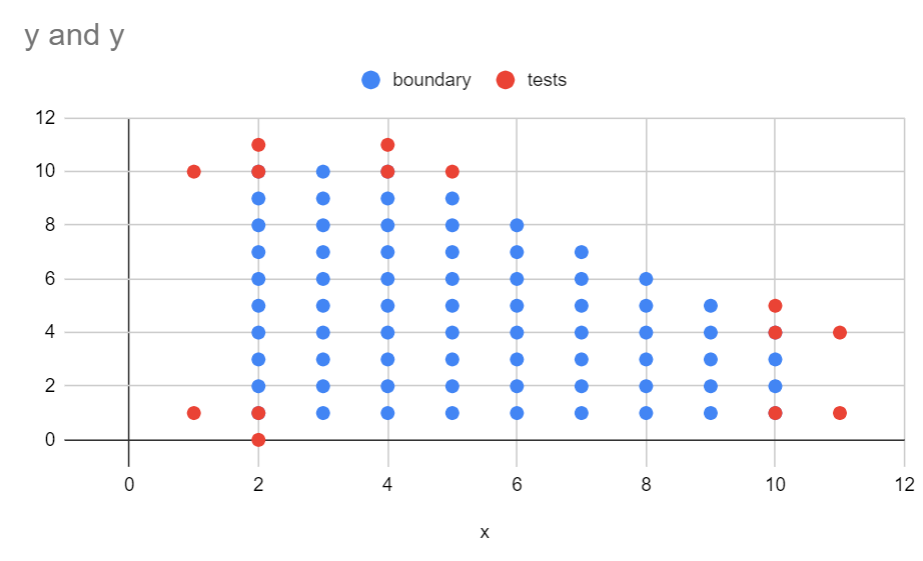

# Piecewise

> **Requirement**: The input domain of a function is a set of all points (x, y) that meet the criteria:
> * `1 < x <= 10`
> * `1 <= y <= 10`
> * `y <= 14 - x`

## Variables
| Variable | Type | Range |
| -------- | ---- | ----- |
| x | integer | `1 < x <= 10`
| y | integer | `1 <= y <= 10`, `y <= 14 - x`

### Dependency among variables
`x` and `y` are dependent, since the range in `y` varies according to `x`.

## Equivalence Partitioning/Boundary Analysis
| Variable | Equivalence classes | Invalid classes | Boundaries |
| -------- | ------------------- | --------------- | ---------- |
| x | `1 < x <= 10` | | |
| | | | `(1, in)` |
| | | | `(2, in)` |
| | | | `(10, in)` |
| | | | `(11, in)` |
| y | `1 <= y <= 10` | | |
| | | | `(in, 1)` |
| | | | `(in, 0)` |
| | | | `(in, 10)` |
| | | | `(in, 11)` |
| | `y <= 14 - x` | | |
| | | | `(4, 10)` |
| | | | `(5, 10)` |
| | | | `(10, 4)` |
| | | | `(11, 4)` |

### Strategy
Make tests for all 12 boundaries

| Test case | x | y | output |
| --------- | - | - | ------ |
| T1 | 1 | 5 | false |
| T2 | 2 | 5 | true |
| T3 | 10 | 2 | true |
| T4 | 11 | 2 | false |
| T5 | 3 | 1 | true |
| T6 | 3 | 0 | false |
| T7 | 3 | 10 | true |
| T8 | 3 | 11 | false |
| T9 | 4 | 10 | true |
| T10 | 5 | 10 | false |
| T11 | 10 | 4 | true |
| T12 | 11 | 4 | false |

## Chart Strategy

| Test case | x | y | output |
| --------- | - | - | ------ |
| T1 | 1 | 1 | false |
| T2 | 2 | 1 | true |
| T3 | 10 | 1 | true |
| T4 | 11 | 1 | false |
| T5 | 2 | 0 | false |
| T6 | 2 | 10 | true |
| T7 | 2 | 11 | false |
| T8 | 4 | 10 | true |
| T9 | 4 | 11 | false |
| T10 | 10 | 4 | true |
| T11 | 10 | 5 | false |
| T12 | 11 | 4 | false |
| T13 | 1 | 10 | false |
| T14 | 5 | 10 | false |